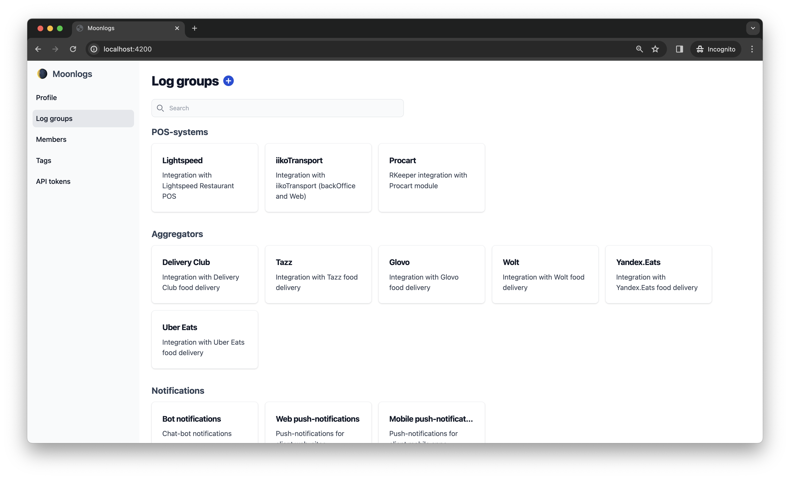
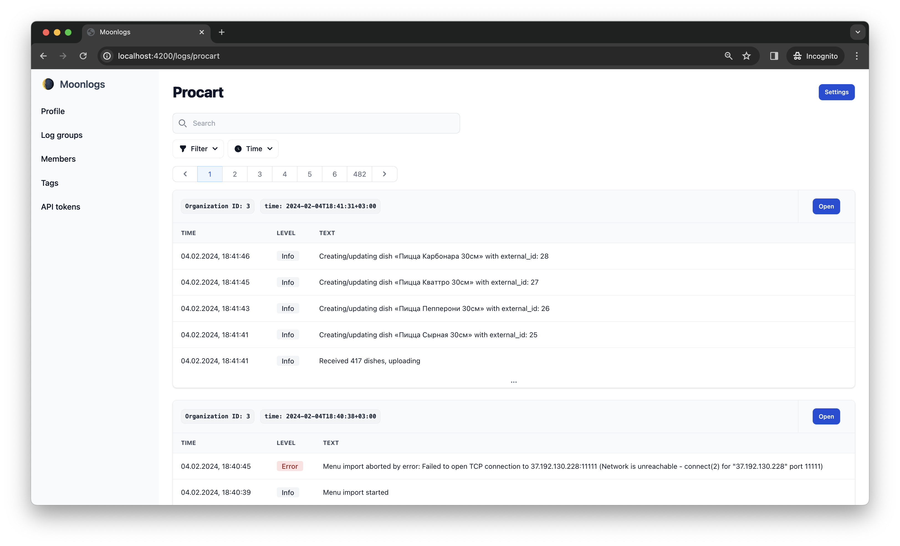
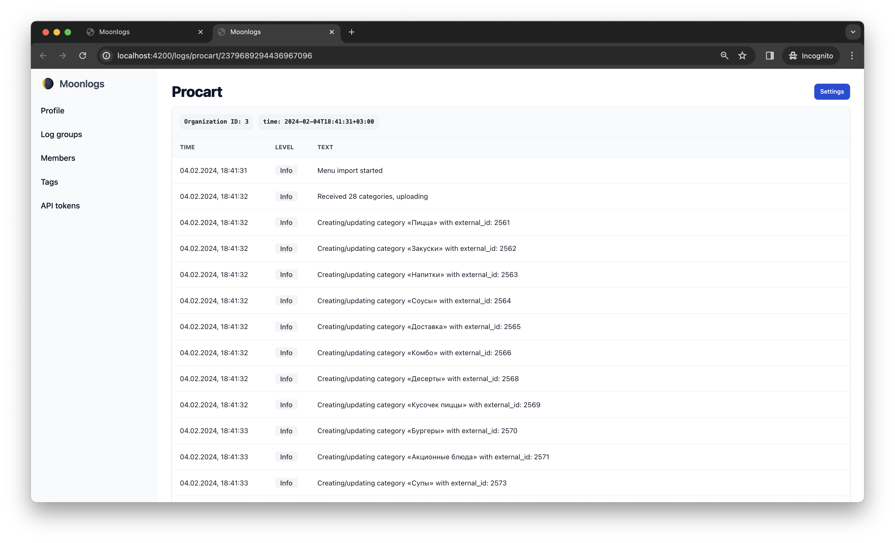
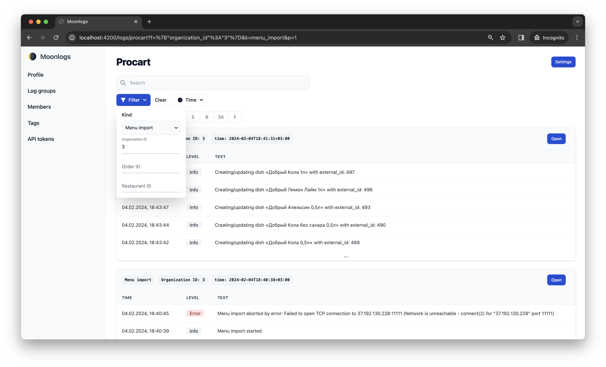
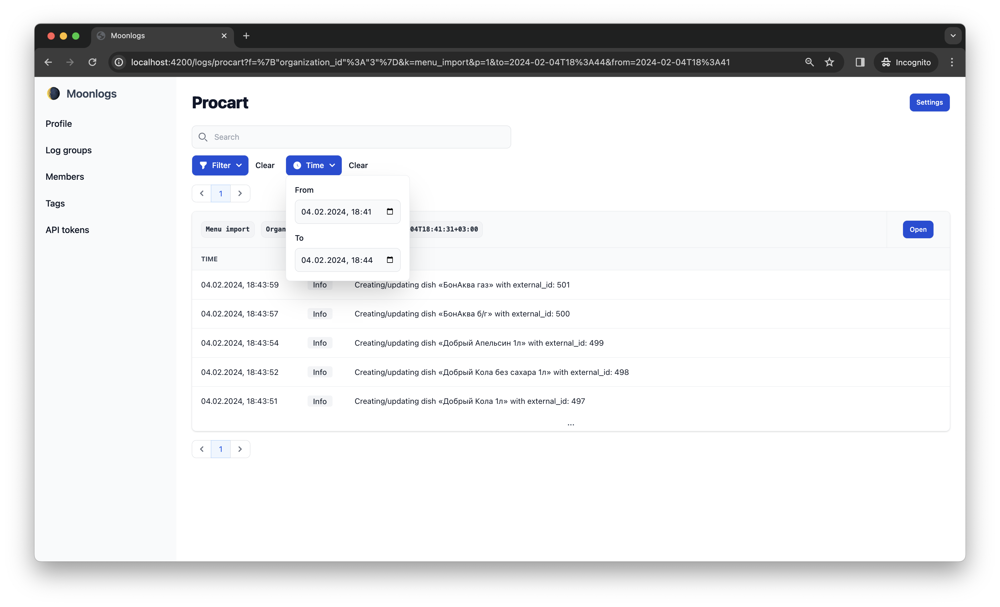
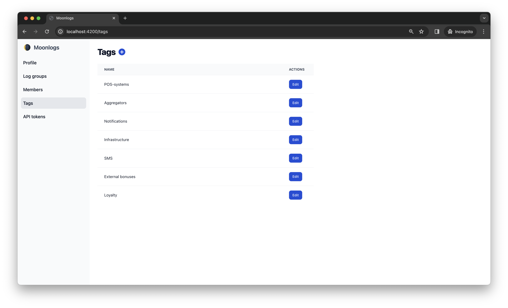
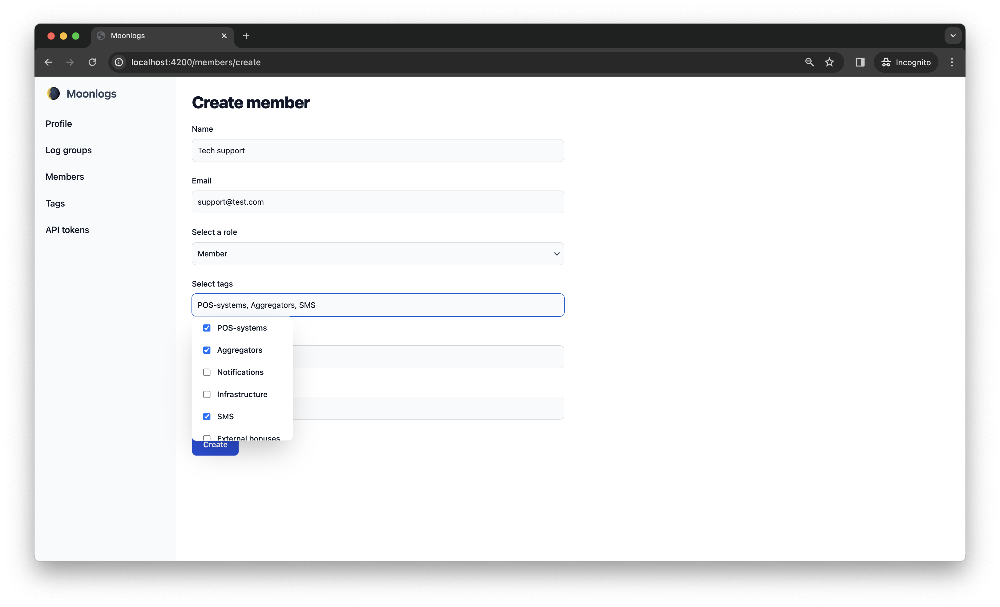

[](https://github.com/pijng/moonlogs/actions/workflows/release.yml)

[![Feature-Sliced Design][shields-fsd-white]](https://feature-sliced.design/)

[shields-fsd-white]: https://img.shields.io/badge/Feature--Sliced-Design?style=for-the-badge&labelColor=262224&color=F2F2F2&logoWidth=10&logo=data:image/png;base64,iVBORw0KGgoAAAANSUhEUgAAABQAAAAaCAYAAAC3g3x9AAAACXBIWXMAAALFAAACxQGJ1n/vAAAAAXNSR0IArs4c6QAAAARnQU1BAACxjwv8YQUAAAA/SURBVHgB7dKxCgAgCIThs/d/51JoNQIdDrxvqMXlR4FmFs92KDIX/wI7JSdDN+eHtkxIycnQvMNW8hN/crsDc5QgGX9NvT0AAAAASUVORK5CYII=


<p align="center">
  
</p>

**Moonlogs** is a business-event logging tool with a built-in user-friendly web interface for easy access to events.

## Docs

Visit [moonlogs.pages.dev](https://moonlogs.pages.dev) for documentation and guides about Moonlogs.

## Quick Features

- Meta-groups of events based on business domains
- Query-based event subgrouping
- Convenient schema-based filters
- Flexible event retention time
- Granular Access Control with Tags

## Table of Contents

- [Installation](#installation)
- [Features](#features)
- [SDKs](#SDK)
- [Considerations](#considerations)


## Installation

### Option 1: Using APT Repository

1. **Add APT Repository:**

Open a terminal and run the following commands to add the APT repository:

```bash
sudo add-apt-repository "deb [trusted=yes] https://apt.fury.io/pijng/ /"
sudo apt-get update
```

2. **Install moonlogs package:**

```bash
apt-get install moonlogs
```
Moonlogs will be immediately available as a service managed by systemd.

3. **Check the status of the service:**

```bash
service moonlogs status
```

Navigate to [http://localhost:4200](http://localhost:<your-port>). You should see the moonlogs UI. Follow the instructions for creating the initial administrator there.


### Option 2: Using Docker Compose

1. **Prerequisites**

Make sure you have Docker installed on your system.


2. **Create a Docker Compose File:**

Create a file named `docker-compose.yml` in your desired directory and copy the following content into it:

```yaml
version: '3'

services:
  moonlogs:
    image: pijng/moonlogs
    restart: always
    ports:
      - "4200:4200"
    volumes:
      - moonlogs-config:/etc/moonlogs
      - moonlogs-data:/var/lib/moonlogs
    command: --port=4200
volumes:
  moonlogs-config:
  moonlogs-data:
```

Save the file.

3. **Build and Run the Docker Containers:**

Open a terminal in your project's root directory and run the following command:

```bash
docker-compose up -d
```

This will download the moonlogs image and start the moonlogs container in detached mode.

4. **Access moonlogs:**

Navigate to [http://localhost:4200](http://localhost:<your-port>). You should see the moonlogs UI. Follow the instructions for creating the initial administrator there.


### Configuration Options

#### With `docker-compose` installation

- Moonlogs container is configured to run on port 4200 by default. If you need to change the port, update the `--port` parameter in the `command` section of the `docker-compose.yml` file.

- By default, moonlogs uses a Docker volume named `moonlogs-data` to store configuration and database files. This ensures persistent data even if the container is stopped or removed.
If you prefer to use your own bind mount for data storage, you can modify the `volumes` section in the `docker-compose.yml` file.

    * Remove the line at the bottom of `docker-compose.yml`:

        ```yaml
        volumes:
          moonlogs-data:
        ```

    * Change the `services.moonlogs.volumes` directive to:

        ```yaml
        volumes:
          - <your-desired-dir-on-host>:/etc/moonlogs
        ```

    * The resulting file may look like the following:

        ```yaml
        version: '3'

        services:
          moonlogs:
            image: pijng/moonlogs
            restart: always
            ports:
              - "4200:4200"
            volumes:
              - /etc/moonlogs:/etc/moonlogs
              - /var/lib/moonlogs:/var/lib/moonlogs
            command: --port=4200
        ```

#### With `apt-get` installation

- Moonlogs service is configured to run on port 4200 by default. If you need to change the port, you can modify the `port` parameter in the config file:

  * Open the config file located at `/etc/moonlogs/config.yml`


  * Update `port` parameter to your desired port number. For example:
    ```yaml
    port: 5000
    db_path: /var/lib/moonlogs/database.sqlite
    db_adapter: sqlite
    read_timeout: 5s
    write_timeout: 1s
    ```

  * Restart the moonlogs service to apply the new configuration:

    ```bash
    service moonlogs restart
    ```

## Features

#### Meta-groups for log organization



Create separate meta-groups (schemas) to categorize events by domain areas. For instance, create schemas for the checkout process, user access setting changes, and Uber Eats integration. Events within each schema are recorded independently, facilitating efficient event retrieval.

#### Query-based log subgrouping




Group events within a schema based on specified queries to enhance information integrity. Events for distinct clients, such as those with IDs 4 and 5, will be segregated within the overall schema. This not only simplifies searchability but also ensures unrelated events remain separate even if in the same schema.

#### Convenient schema-based filters




Generate convenient filters on the web interface for each schema, simplifying event search by allowing users to simply input values. This eliminates the complexity of composing queries with an undefined set of parameters, making it user-friendly, especially for non-technical personnel.

#### Flexible event retention time


Specify varying retention times for each schema to align with specific business needs. For instance, set a 7-day retention time for event in the "Glovo integration" schema, while events in the "User's rights change history" schema can be stored indefinitely. Adjust these settings dynamically as business requirements evolve.

#### Granular Access Control with Tags




Create and assign tags to schemas and users, enabling granular access control. Define access privileges based on tags, ensuring that users can only access the schemas and events relevant to their responsibilities. This feature provides an additional layer of security and customization in managing access to events data.

## SDK

Moonlogs provides Software Development Kits (SDKs) to simplify the integration process for various programming languages. Choose the SDK that matches your preferred language to quickly incorporate our functionality into your projects.

#### Available SDKs

- [Ruby SDK](https://github.com/pijng/moonlogs-ruby)
- [Typescript SDK](https://github.com/pijng/moonlogs-ts)


## Considerations

Moonlogs is a specialized logging solution designed with a primary focus on capturing business event logs. It excels at providing insights into business processes, user interactions, and custom events tailored for your application.

### When not to use moonlogs

While moonlogs is powerful for business-event logging, there are specific scenarios where it might not be the best fit:

**1. Auditing Logging**

Moonlogs is not intended for exhaustive auditing purposes. If your requirement involves detailed audit logs for compliance or security, consider dedicated auditing tools like Datadog, SolarWinds, or other specialized solutions.

**2. System Logs**

Moonlogs is not designed to handle low-level system logs. For system-level monitoring and troubleshooting, solutions like ELK Stack or centralized logging systems may be more appropriate.

**3. Application Performance Monitoring & Error Tracking**

Moonlogs focuses on capturing business events and is not a substitute for dedicated Application Performance Monitoring (APM) or Error Tracking tools. For deep insights into application performance and error diagnostics, explore tools like New Relic, Dynatrace, Sentry, or similar APM solutions.
